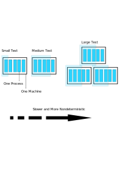

# Testing Overview

> keywords: automated testing, test coverage

testing 은 단순히 bug 를 잡는 것을 넘어서 "adding new feature", "refactoring", "redesign" 을 용이하게 한다.
더 나은 발전된 기술을 적용하기 위해서는 더 빠른 테스트가 필요하다.
구글이 더 크고 복잡한 codebase 를 유지하기 위해서는 automated testing 이 필요했다.

## Why Do We Write Tests?

test란?

- single behavior 를 확인하는 것: method, function, API 등등
- specific input 를 확인하는 것
- observable output, behavior 를 확인하는 것
- controlled environment 에서 수행

why do we write tests?

- programmer ability 에 대한 의존성이 낮아진다.
- debugging 에 드는 비용을 줄인다.

#### Testing at the Speed of Modern Development

- 요즘음 만들어지는 SW 는 아주 크고 빠르게 변화하기 때문에, test 의 automation 이 필요하다.
  - 사람이 일일이 debugging/test 할 수 없다.

#### Write, Run, React

- testing automation 은 writing tests -> running tests -> reacting to test (success for failure) 의 절차로 수행된다.

#### Benefits of Testing Code

- testing code 를 쓰는 것은 새로운 기능을 추가하는 것보다 더 시간이 많이 걸릴 수 도 있지만 다음의 이점들이 생산성을 높여줄 수 있다.
  - less debugging
  - increaded confidence in changes
  - improved documentation
    - 잘 만든 test 는 그 자체로 훌륭한 documentation 이다.
    - open source 를 활용할 때에는 test 코드를 먼저 확인해 보자.
  - Simpler reviews
  - thoughtful design
    - test 코드를 고려하면 더 나은 API, method, function 을 design 할 수 있다.

## Designing a Test Suite

> Two distinct dimensions for every test: size and scope

#### Test size

- small test

  - single thread 에서 수행되어야 한다.
  - 보통은 third-party 없이 돌아가야한다.
  - network 나 disk 에 대한 access 가 없다.
  - unit test 의 형태

- medium test

  - single machine 에서 수행되어야 한다.
  - `localhost` 수준의 networking, process blocking 이 포함된다.

- large test

  - build and release process

- common properties
  - 독립된 test 이어야 한다.

#### Test Scope

- narrow-scoped test (80%)
  - unit test
  - fast, stable
- medium-scoped test (15%)
  - interactions between two or more components
  - for integration
- large-scoped test (5%)
  - end-to-end test

#### Beyoncè Rule

> If you liked in, then you should put a test on it!

## Testing at Google Scale

CI system (Test Automated Platform)

#### The Pitfalls(함정) of a Large Test Suite

- 한줄 바꿨는데 10개 test 에 실패할수도...
  - test 를 잘 만들어야 한다.
  - 빠르고 deterministic 하게 만들어야 한다.

## History of Testing at Google

- 2005~2006년 부터 automated testing 의 혁신이 이루어졌다.
- testing 을 중요시 하는 문화를 만들기 위해 노력했다.

#### Orientation Classes

2005년 automated testing 의 중요성을 강의하기 시작함

#### Test Certified

#### Testing on the Tolilet

#### Testing Culture Today

- 강요보다는 왜 필요한지, test 를 하면 어떻게 좋은지를 퍼트리는데 노력하고 있음

## The Limits of Automated Testing

- human judgment 가 필요할 때 -> test 로 추가할 수 있다.

## Conclusion

- Automated testing 은 Google 이 빠르게, 크게 성장할수 있었던 요인이다.
- 좋은 test 를 만들어야 한다.
- culture 를 바꿔야 한다.
