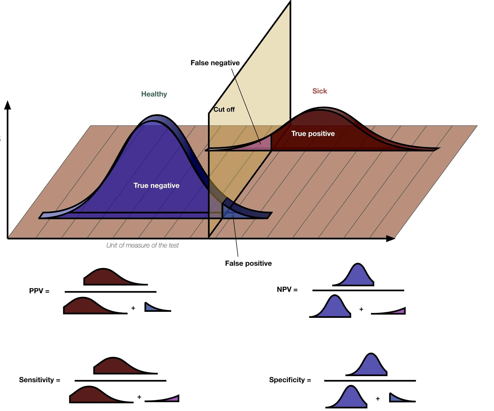

# Static Analysis

- static analysis: source code analysis without executing program
  - styling, fix bug, antipatterns and so on...

## Characteristics of Effective Static Analysis

### Scalability

- Codebase 가 커져도 incremental 하게 static analysis 를 수행할 수 있어야 한다.
  - pre-commit tool 사용시 commit 부분에만 static analysis 를 적용함

### Usability

- 쓰기 좋아야 한다
  - static analysis warning 을 제거하기 위해 너무 많은 시간을 쓰지 않도록 한다.

## Key Lessons in Making Static Analysis Work

### 1. Focus on Developer Happiness

- developer 가 및을 수 있는 tool을 만들어야 한다.
  - low false-positive tool 이 중요하다.
    

### 2. Make Static Analysis a Part of the Core Developer Workflow

- code 가 commit 되고 integration 되는 과정에서 수행되어야 한다.

### 3. Empower Users to Contribute

- 사용자들이 static analysis tool을 향상시킨다.

## Tricoder: Google's Static Analysis Platform

- Google 만 쓰는 tools...
- 우리는?...
  - pre-commit 을 통해서 static analysis 를 수행 (하자...)
    - cpplint (c++ static analysis tool)
    - pylint (python static analysis tool)
    - clang-format (c++ formatter)
    - black (python formatter)
    - JS 도 많이 있음...

## Conclusion

1. 좋은 tool을 만들어야 한다.

   - 좋은 tool 들이 많으니 일단 써보자...

2. Workflow 에 녹아있어야 한다.
3. 사용자의 feedback 이 중요하다.
