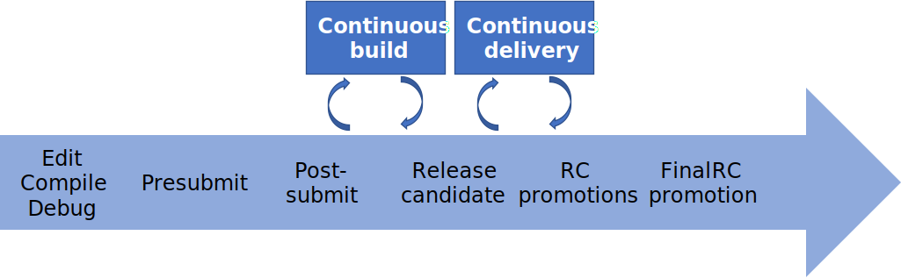

# Continuous Integration (CI)

- CI: 주로 automated build and release processes 를 의미한다.
- Goal of CI: 문제가 있는 변화를 **일찍**, **자동**으로 찾아내는 것

## CI Concepts

### 1. Fast Feedback Loops

- feedback 의 종류
  - edit-compile-debug loop
  - automated test on presubmit
  - integration error in post-submit (after submitted and tested)
  - incompatibility dependency
  - bug report
- accessible and actionable feedback

* 구글에서는 누구나 결과를 확인하고 reporting 할 수 있는 시스템이 있음
* visibility 가 engineer 들이 feedback 을 통해 협업할 수 있도록 도와준다.
* 사용하기 쉬워야 한다 -> 문제를 찾기 쉽고, 고치기 쉬워진다.

### 2. Automation

- Continuous Build
- Continuous Delivery (Release)
  - Release Candidate (RC): 구글에서는 대규모 코드들의 CI system 을 위해서 RC 를 두고 CD 과정에서 이를 조합하는 과정을 거침

### 3. Continuous Testing

- post-submit
  - presubmit 은 개발자의 개발 속도를 지연시킬 수 있음 -> 모든 테스트를 presubmit 에서 다 하기에는 비용이 많이 든다.
  - presubmit 이 커져서 많은 시간이 소요될 경우, presubmit 진행중에 변경된 부분들을 반영하지 못함 (mid-air collision)
  - presubmit은 "only fast, reliable ones" 만 test
- CB를 거쳤는데 왜 RC testing?
  - sanity check (double check)
  - cherry picks: 필요한 부분만 cherry pick fix 가능
  - emergency pushes: 문제 있는 부분만 push 가능

### 4. CI Challenges

* presubmit optimization
* culprit finding and failure isolation
* resource constraints
* failure management: fail 을 어떻게 대응할지

### 5. Hermetic Testing

> Hermetic test: 밀폐된 테스트

## But I Can't Afford CI
쓸만한 비용이다...

## Conclusion

- CI system은 어떤 테스트를 할지, 언제 테스트를 할지 결정한다.
- CI system은 codebase 가 오래되고 커질수록 필요해진다.
- CI system은 presubmit 에서는 빠르게, post-submit 에서는 그보다 느리고 더 결정적인 테스트롤 하도록 최적화 되어야 한다.
- 접근 가능하고 대응 가능한 feedback 이 CI system을 더 효율적으로 만든다.
